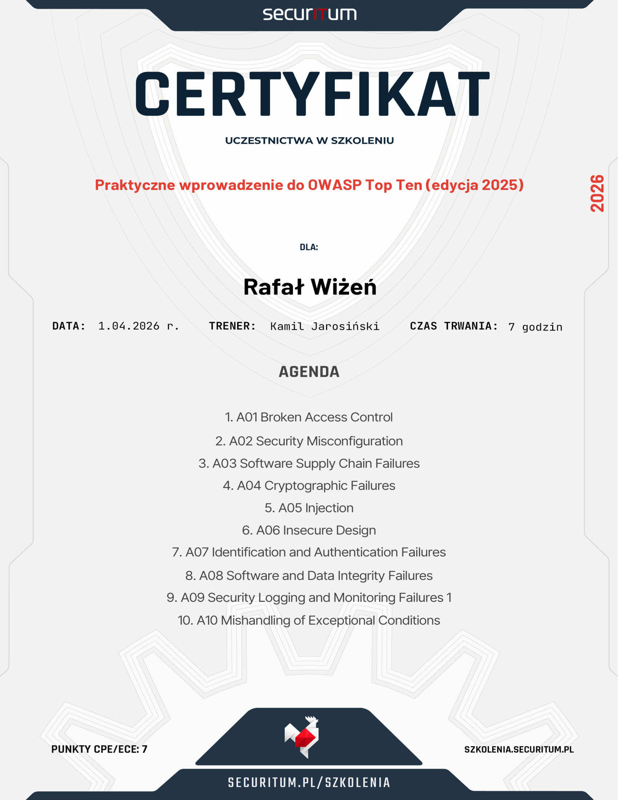

# Droga Nowoczesnego Architekta 23-01-2026

**CERTIFICATE OF COURSE COMPLETION**

This certificate confirms the completion of the 5-month Droga Nowoczesnego Architekta course, covering the following skills:

- Knowledge and practical application of Domain-Driven Design (DDD) and Event Sourcing (ES)
- Practical skills in Command Query Responsibility Segregation (CQRS)
- Understanding of effective microservices architecture and associated patterns
- Planning system architectures while considering best practices and architectural patterns
- Advanced analytical skills for evaluating and improving systems
- Design and implementation of distributed systems
- Knowledge and skills in designing and implementing event-driven systems
- Ability to use Event Storming for effective domain modeling and system design
- Designing and implementing effective information systems architectures
- Understanding of architectural patterns and anti-patterns, and their application
- Integration and operation within existing systems

**Course instructors:**

- Łukasz Szydło
- Jakub Kubryński
- Jakub Pilimon

**Devstyle sp. z o.o.** EST. 2008

---

# OWASP Top 10 Training 01-04-2025

**CERTIFICATE OF TRAINING COMPLETION**

This certificate confirms the completion of the OWASP Top 10 security training conducted by **Securitum**, covering the OWASP Top 10 (2025 edition) security risks.

**Instructor:** Kamil Jarosinski (Securitum)

The training covered all 10 OWASP Top 10 categories with practical demos and security checklists:

| # | Category | Key Topics |
|---|----------|------------|
| A01 | Broken Access Control | IDOR, forced browsing, role manipulation, CORS misconfiguration, SSRF |
| A02 | Security Misconfiguration | Verbose exceptions, security headers, cookie flags, default credentials |
| A03 | Software Supply Chain Failures | Vulnerable components, SBOM, dependency scanning (Snyk, Trivy) |
| A04 | Cryptographic Failures | TLS configuration, encryption algorithms, password hashing (bcrypt, argon2), CSPRNG |
| A05 | Injection | SQL Injection, XSS, SSTI, parameterized queries, whitelist validation |
| A06 | Insecure Design | S-SDLC, threat modeling, attack trees |
| A07 | Authentication Failures | Bruteforce protection, 2FA implementation, JWT security, password reset flows |
| A08 | Software or Data Integrity Failures | Insecure deserialization, Subresource Integrity (SRI), CI/CD integrity checks |
| A09 | Logging & Alerting Failures | Log hygiene, centralized logging, monitoring, incident response |
| A10 | Mishandling of Exceptional Conditions | Integer overflow, numeric precision, missing parameter validation |

**Securitum** (securitum.pl)

