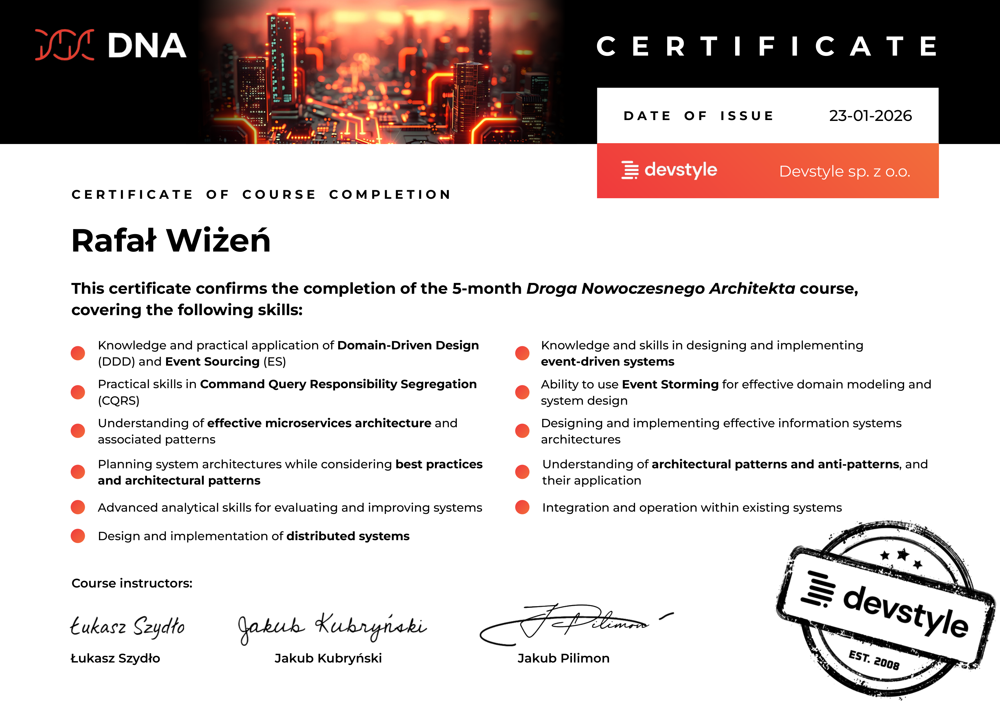

# Droga Nowoczesnego Architekta 23-01-2026

**CERTIFICATE OF COURSE COMPLETION**

This certificate confirms the completion of the 5-month Droga Nowoczesnego Architekta course, covering the following skills:

- Knowledge and practical application of Domain-Driven Design (DDD) and Event Sourcing (ES)
- Practical skills in Command Query Responsibility Segregation (CQRS)
- Understanding of effective microservices architecture and associated patterns
- Planning system architectures while considering best practices and architectural patterns
- Advanced analytical skills for evaluating and improving systems
- Design and implementation of distributed systems
- Knowledge and skills in designing and implementing event-driven systems
- Ability to use Event Storming for effective domain modeling and system design
- Designing and implementing effective information systems architectures
- Understanding of architectural patterns and anti-patterns, and their application
- Integration and operation within existing systems

**Course instructors:**

- Łukasz Szydło
- Jakub Kubryński
- Jakub Pilimon

**Devstyle sp. z o.o.** EST. 2008

